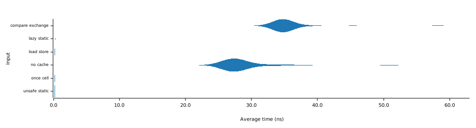

+++
title = "Benchmarking Caches in Rust"
date = "2024-01-31"

[taxonomies]
tags=["rust", "performance"]
+++

<style>
/* Use full width for images */
img {
    width: 100%;
}

/* Inverts the svg charts for dark mode */
:root.dark img {
    filter: invert(1);
}
</style>


# Preface

I'm currently working on an Intel hypervisor (very fun project btw) and had the following problem: The hypervisor needs to be very performant (otherwise the system slows down) so I have to cache as many things as possible. But how do I do that? I know that there are some crates that provide a nice API for one-time initialized static variables. But how do they work under the hood? And are they the best solution? Let's find out!

# Naive Solution

One solution would be to don't cache the value at all. This will serve as a baseline for the other solutions. We'll use the [CPUID](https://namazso.github.io/x86/html/CPUID.html) instruction as an example value which should be cached, as I'm also using it to detect CPU features in my hypervisor. I wanted to keep the benchmark as close as possible to the real use case to not fall into any traps. 

We can define the benchmark function as follows:
```rust
fn calc_value() -> u64 {
    black_box(x86::cpuid::cpuid!(0).eax as u64)
}

fn cached_value() -> u64 {
    // just don't cache anything lol
    calc_value()
}
```

## Benchmark

Let's benchmark it using [criterion](https://bheisler.github.io/criterion.rs/book/). 

28ns is quite fast, but what if we have an instruction that takes much longer? What if we want to log the value or have to do heavy computations? This would slow it down a lot. Let's see if we can do better.


# OnceCell

Like any good programmer, my second solution was to use the most popular crate I could find on the web: [once_cell](https://crates.io/crates/once_cell). It provides a very simple API to create a lazy static variable. We'll be using the `calc_value` function from the previous example. 

```rust
use once_cell::sync::OnceCell;

pub fn cached_value() -> u64 {
    static CACHED_VALUE: OnceCell<u64> = OnceCell::new();

    *CACHED_VALUE.get_or_init(calc_value)
}
```

## How it's implemented

The implementation of `OnceCell` is quite interesting because it's based on atomic operations to ensure thread safety. It has an [unsafe cell](https://doc.rust-lang.org/std/cell/struct.SyncUnsafeCell.html) (used for interior mutability) and an [atomic state](https://doc.rust-lang.org/std/sync/atomic/struct.AtomicU8.html). The state is used to ensure that the value is only initialized once.

```rust
pub(crate) struct OnceCell<T> {
    state: AtomicU8,
    value: UnsafeCell<Option<T>>,
}

// Possible values for state:
const INCOMPLETE: u8 = 0x0;
const RUNNING: u8 = 0x1;
const COMPLETE: u8 = 0x2;
```

They built a very nice and easy-to-use API on top of it which explains the popularity of the crate.

```rust
impl<T> OnceCell<T> {
    const fn new() -> OnceCell<T> { ... }
    fn set(&self, value: T) -> Result<(), T> { ... }
    fn get(&self) -> Option<&T> { ... }
}
```

<!-- 
Disasm:
https://godbolt.org/z/b84rTzd7q
 -->

## Benchmark

The solution is quite straightforward, but how does it perform?


Not bad. It takes on average around 215ps to get the value. That's already a 140x speedup. But can we do better?


# lazy_static

Let's check out another equally popular crate: [`lazy_static`](https://crates.io/crates/lazy_static). It provides a macro that allows us to create a lazy static variable.

```rust
use lazy_static::lazy_static;

pub fn cached_value() -> u64 {
    lazy_static!{
        static ref CACHED_VALUE: u64 = calc_value();
    }

    *CACHED_VALUE
}
```

## How it's implemented

`lazy_static` uses the [`Once`](https://docs.rs/spin/0.9.8/spin/once/struct.Once.html) synchronization primitive from the [spin](https://crates.io/crates/spin) crate. The `Once` primitive can be used to call a function exactly once (as the name suggests):

```rust
use spin;

static START: spin::Once = spin::Once::new();

START.call_once(|| {
    // run initialization here
});
```

The implementation under the hood is very similar to `once_cell`. We have a status, an unsafe cell for the data and a [phantom data](https://doc.rust-lang.org/std/marker/struct.PhantomData.html).

```rust
pub struct Once<T = (), R = Spin> {
    phantom: PhantomData<R>,
    status: AtomicStatus,
    data: UnsafeCell<MaybeUninit<T>>,
}
```

With this primitive, one can easily implement the container for the data behind the lazy_static macro. Add some syntactic sugar and we have a very nice API.

```rust
use self::spin::Once;

pub struct Lazy<T: Sync>(Once<T>);

impl<T: Sync> Lazy<T> {
    pub const INIT: Self = Lazy(Once::INIT);

    #[inline(always)]
    pub fn get<F>(&'static self, builder: F) -> &T
    where
        F: FnOnce() -> T,
    {
        self.0.call_once(builder)
    }
}
```

## Benchmark

Since the synchronization primitives used under the hood are so similar to `once_cell`, the performance is also very similar with 320ps on average.


# Atomics

If you look back at the code of `once_cell` and `lazy_static`, you will notice that they both use atomic operations to ensure thread safety. But what are atomic operations and how do they work? Let's find out!

## What are they? 

Atomics behave the same way as normal operations (read, write, add, sub, etc.) but they come with further guarantees. They ensure that the operation is executed atomically, meaning that no other thread can access the memory location at the same time. They also provide the option to specify [memory ordering](https://en.wikipedia.org/wiki/Memory_ordering).

## What the hell is Memory Ordering?

Compilers and CPUs are allowed to reorder memory accesses for performance reasons ([out-of-order-execution](https://en.wikipedia.org/wiki/Out-of-order_execution?useskin=vector)). By using Atomics, we can specify the order in which memory accesses should be executed.

Instruction reordering might not be an issue for simple programs, but it can lead to very subtle bugs in concurrent programs. Let's take this example (taken from the to [Rust Atomics and Locks](https://marabos.nl/atomics/memory-ordering.html) book by Mara Bos):

```rust
static X: AtomicI32 = AtomicI32::new(0);
static Y: AtomicI32 = AtomicI32::new(0);

fn thread_a() {
    X.store(10, Relaxed);
    Y.store(20, Relaxed);
}

fn thread_b() {
    let y = Y.load(Relaxed);
    let x = X.load(Relaxed);
    println!("{x} {y}");
}
```

The CPU can execute these instructions in any order. Possible outputs are: 
- `0 0`: Thread B reads the values before Thread A was able to write them.
- `10 0`: Thread A writes X, then Thread B reads both.
- `10 20`: Thread A writes X and Y, then Thread B reads both.
- `0 20`: Thread A writes Y before X, then Thread B reads both.

How can this lead to issues? Let's take a look at this example:

```rust
static LOCKED: AtomicBool = AtomicBool::new(false);
static VALUE: UnsafeCell<u64> = UnsafeCell::new(u64::MAX);

fn update(value: u64) {
    if LOCKED.load(Relaxed) {
        // Alternatively just spin until it's not locked
        return;
    }

    // <--- Thread could be scheduled here

    LOCKED.store(true, Relaxed);
    unsafe { *VALUE.get() = value };
    LOCKED.store(false, Relaxed);
}
```

If two programs execute the conditional check at the same time, then they'll both try to lock and store the value. The solution: Different memory orderings.

In Rust, there's a non_exhaustive enum called [Ordering](https://doc.rust-lang.org/std/sync/atomic/enum.Ordering.html) which specifies allowed orderings.
- `Ordering::Relaxed`: No guarantees, can be reordered freely.
- `Ordering::Release` (store) and `Ordering::Acquire` (load): When used together, they form a lock. No memory stored after `Release` and no reads before `Acquire`. This is the most common use case for atomics. This achieves a happens-before relationship between the two threads (`Release` is always executed before `Acquire`).
```rust
static READY: AtomicBool = AtomicBool::new(false);
static VALUE: AtomicU64 = AtomicU64::new(u64::MAX);

fn thread_a() {
    VALUE.store(42, Ordering::Relaxed);

    READY.store(true, Ordering::Release); // Executed before `Acquire`
}

fn thread_b() {
    while !READY.load(Ordering::Acquire) {} // Executed after `Release`

    // We can now safely read the value
    println!("{}", VALUE.load(Ordering::Relaxed));
}
```
- `Ordering::AcqRel` (load-with-store): Represents both `Acquire` and `Release`. Used for `compare_exchange` and other operations that do both.
- `Ordering::SeqCst`: Like Acquire/Release/AcqRel (for load, store, and load-with-store operations, respectively) but with additional guarantees. 

Atomics are a complex topic and I can't cover everything in this post. If you want to learn more about it, I can recommend the video [Crust of Rust: Atomics and Memory Ordering](https://www.youtube.com/watch?v=rMGWeSjctlY) by Jon Gjengset and the [Rust Atomics and Locks](https://marabos.nl/atomics/memory-ordering.html) book by Mara Bos.


## How it's implemented

### CompareExchange

With all the theory covered, let's try to implement a cache using `compare_exchange`. For the sake of simplicity, we'll use `Ordering::Relaxed` for all operations. This is safe because in the worst case, we'll just compute the value twice. 

The function `compare_exchange` compares the first argument with the value in the atomic and replaces it with the second argument if they are equal. It returns a `Result` which indicates whether the value was replaced or not.

```rust
pub fn cached_value() -> u64 {
    static CACHED_VALUE: AtomicU64 = AtomicU64::new(u64::MAX);

    let _ = CACHED_VALUE.compare_exchange(
        u64::MAX,
        calc_value(),
        Ordering::Relaxed,
        Ordering::Relaxed,
    );

    CACHED_VALUE.load(Ordering::Relaxed)
}
```

You might think: "Wait, why do we need to load the value again? We just replaced it!". The reason is that `compare_exchange` returns the old value. So we need to load it again to return it.

The `compare_exchange` function is usually used for Mutexes to check whether the lock is already taken and then acquire it. So it might not be the ideal solution, but we'll see how it performs in the benchmark.

```rust
fn update_locked_value(value: u64) {
    while !LOCKED.compare_exchange(
        false,
        true, 
        Ordering::Acquire, Ordering::Relaxed
    ).is_ok() {
        // Optimization: yield
    }

    // Update the value
    unsafe { *VALUE.get() = value };

    LOCKED.store(false, Ordering::Release);
}
``` 

### Load/Store

Since we need a load operation anyway, we can also use `load` and `store` instead of `compare_exchange`. 

```rust
pub fn cached_value() -> u64 {
    static CACHED_VALUE: AtomicU64 = AtomicU64::new(u64::MAX);

    let value = CACHED_VALUE.load(Ordering::Acquire);
    if value != u64::MAX {
        return value;
    }

    let value = calc_value();
    CACHED_VALUE.store(value, Ordering::Release);
    value
}
```

<!-- https://godbolt.org/z/8dTEWsszf -->

## Benchmark

Turns out that `compare_exchange` is a very expensive operation. The retrieval of the cached value takes 34ns on average, which is significantly slower than the previous solutions. It is even slower than the naive solution without caching which took 28ns on average.


In contrast, the load/store solution is very fast with 230ps on average. This is because the CPU can optimize the load/store operations very well (more on that later). 


# Static Mutability

Let's ignore everything we learned about atomics and memory orderings and just use a static mutable variable. This is not thread-safe, but we'll just ignore that for now. This is not an issue for my use case, because I don't have many threads running at the same time when the value is initialized.

```rust
pub fn cached_value() -> u64 {
    static mut CACHED_VALUE: u64 = u64::MAX;

    let value = unsafe { CACHED_VALUE };
    if value != u64::MAX {
        return value;
    } 

    let value = calc_value();
    unsafe { CACHED_VALUE = value };
    value
}
```

<!-- https://godbolt.org/z/q8zdq34Ph -->

## Benchmark

Turns out that this solution generates the same assembly instructions as the load/store solution. Thus the performance is also the same at 230ps on average.


# Why is load/store the same as unsafe-static? 

On x86 CPUs, all memory operations have the ordering of [`AcqRel`](https://doc.rust-lang.org/std/sync/atomic/enum.Ordering.html#variant.AcqRel) so we don't need to specify it explicitly. The compiler also knows this, so all atomic operations can be optimized to much faster `mov` instructions.

Comparing the code on [Compiler Explorer](https://rust.godbolt.org/z/1rPb1aT6o), we can see that there's absolutely no difference between the two solutions.
```asm
example::unsafe_static:
    mov     rax, qword ptr [rip + example::unsafe_static::CACHED_VALUE.0]
    cmp     rax, -1
    je      .LBB0_1
    ret
.LBB0_1:
    push    rax

    cpuid

    mov     eax, eax
    mov     qword ptr [rip + example::unsafe_static::CACHED_VALUE.0], rax
    add     rsp, 8
    ret

example::unsafe_static::CACHED_VALUE.0:
    .quad   -1
```

```asm
example::atomic_load_store:
    mov     rax, qword ptr [rip + example::atomic_load_store::CACHED_VALUE.0]
    test    rax, rax
    je      .LBB1_1
    ret
.LBB1_1:
    push    rax

    cpuid

    mov     eax, eax
    mov     qword ptr [rip + example::atomic_load_store::CACHED_VALUE.0], rax
    add     rsp, 8
    ret

example::atomic_load_store::CACHED_VALUE.0:
    .quad   0
```

<!-- 
```
https://rust.godbolt.org/z/PovzT4EYE

#[cold]
fn calc_value() -> u64 {
    let result: u32;
    unsafe { core::arch::asm!("cpuid", out("eax") result) };
    result as u64
}

pub fn unsafe_static() -> u64 {
    static mut CACHED_VALUE: u64 = u64::MAX;

    let value = unsafe { CACHED_VALUE };
    if value != u64::MAX {
        return value;
    }

    let value = calc_value();
    unsafe { CACHED_VALUE = value };
    value
}

pub fn atomic_load_store() -> u64 {
    use core::sync::atomic::{AtomicU64, Ordering};

    static CACHED_VALUE: AtomicU64 = AtomicU64::new(0);

    let value = CACHED_VALUE.load(Ordering::Acquire);
    if value != 0 {
        return value;
    }

    let value = calc_value();
    CACHED_VALUE.store(value, Ordering::Release);
    value
}
```
 -->

# Comparing all solutions

Turns out, it doesn't matter which crate or option we choose as long as we don't use the `compare_exchange` implementation. I'd suggest using `once_cell` or `lazy_static` because they provide a nice API and are easy to use.

However, one could benefit from the unsafe static approach when writing code for a platform that has a different default memory ordering (RISC-V or ARM).



I thought there would be a bigger difference between the different solutions. But `once_cell`, `lazy_static` and `load-store` are almost equally as fast. 

```
cached-value/no cache   time:   [27.438 ns 27.823 ns 28.338 ns]
cached-value/once cell  time:   [216.02 ps 216.82 ps 217.75 ps]
cached-value/lazy static
                        time:   [320.65 ps 321.75 ps 323.15 ps]
cached-value/compare exchange
                        time:   [34.701 ns 34.811 ns 34.953 ns]
cached-value/load store time:   [234.55 ps 235.03 ps 235.62 ps]
cached-value/unsafe static
                        time:   [227.99 ps 228.74 ps 229.73 ps]
```

I also used the [`microbench`](https://crates.io/crates/microbench) crate to get a better overview of the performance. The results are similar to the ones from [`criterion`](https://crates.io/crates/criterion):
```
no cache (5.0s) ...                       27.115 ns/iter (0.999 R²)
once cell (5.0s) ...                       0.221 ns/iter (0.999 R²)
lazy static (5.0s) ...                     0.474 ns/iter (1.000 R²)
compare exchange (5.0s) ...               34.937 ns/iter (0.999 R²)
load store (5.0s) ...                      0.236 ns/iter (1.000 R²)
unsafe static (5.0s) ...                   0.226 ns/iter (1.000 R²)
```

You can find the benchmarks [here](https://github.com/not-matthias/cache-bench). 

# Conclusion

Here are some takeaways from this benchmark:
- **Compare against dumb solution**: It's really easy to implement and can reveal some interesting insights (like the `compare_exchange` solution being slower than the dumb solution).
- **Keep it close to the real world**: Don't try to benchmark the calculation of `2 + 2`, but rather something close to your use case. In my case, this was the CPUID instruction. 
- **Avoid premature optimizations**: Most of the time, you won't benefit from reducing the time from 28ns to 200ps, even though it sounds impressive. Don't optimize prematurely, and don't bother optimizing one-time costs. The gist [Achieving warp speed with Rust](https://gist.github.com/kvark/f067ba974446f7c5ce5bd544fe370186) has very useful tips for benchmarking.
  - However, I believe it was worth it in my case because I was actually using `compare_exchange`. It's always useful to have benchmarks to back up your decisions.
- Use `once_cell` or `lazy_static`

---

I really enjoyed working on this benchmark. I was able to refresh my knowledge about memory orderings and atomics. If you have any comments, feel free to reach out to me. 

As always, thanks for reading!
